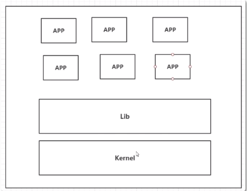
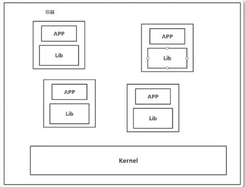
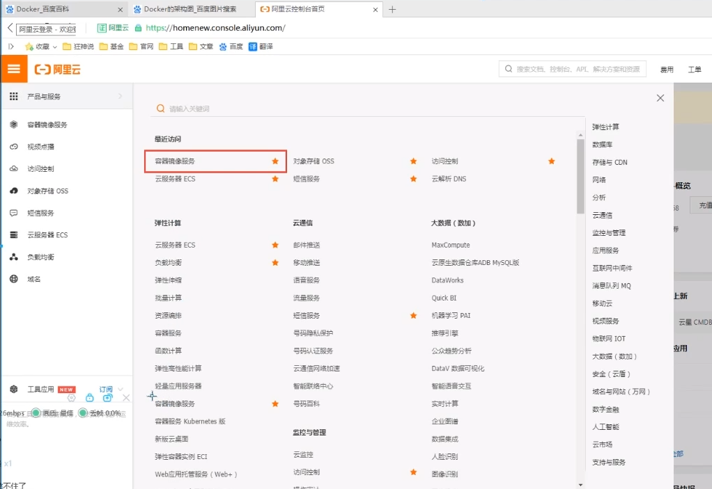
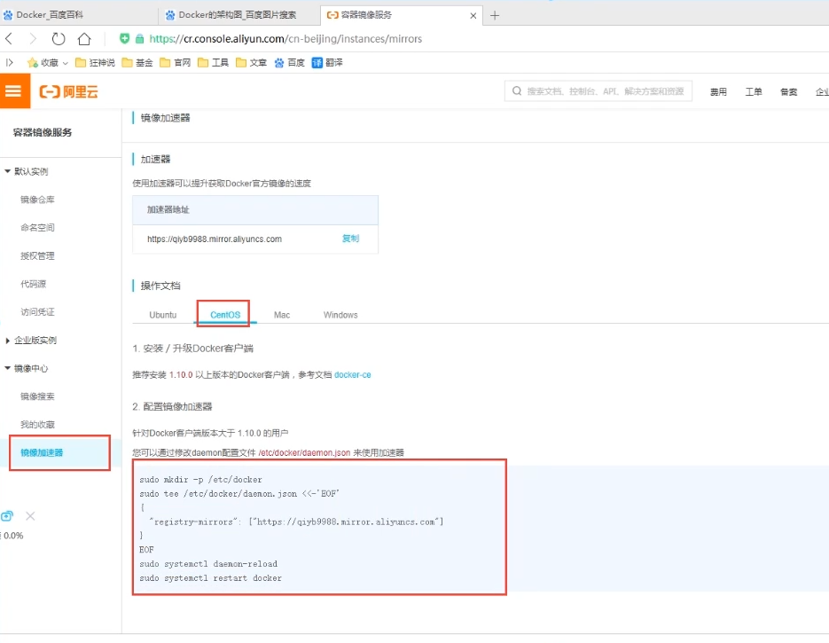
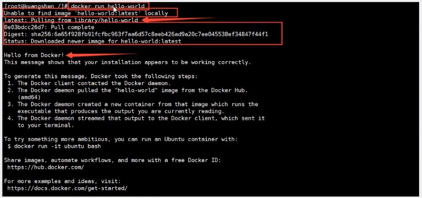
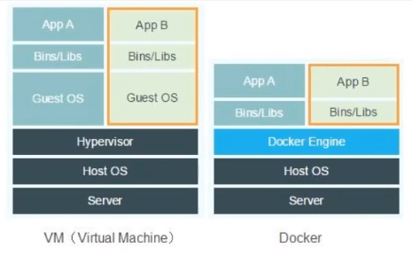

#  Docker 学习
[教程视频地址](https://www.bilibili.com/video/BV1og4y1q7M4?p=9&spm_id_from=pageDriver)

[笔记地址](https://blog.csdn.net/xiaozecheng/article/details/106145593)
## 一、概述
### 1、大纲
* Docker概述
* Docker安装
* Docker命令
    * 镜像命令 
    * 容器命令
    * 操作命令
    * ...
* Docker镜像
* 容器数据卷
* DockerFile
* Docker网络原理
* IDEA整合Docker
* Docker Compose
* Docker Swarm
* CI\CD Jenkins
### 2、相关网站
* Docker基于Go语言开发的！开源项目！
* > 官网：https://www.docker.com/
* > 文档：https://docs.docker.com/
* > 仓库：https://hub.docker.com/
### 3、Docker优缺点
* 虚拟机技术缺点：
    * 1、资源占用十分多
    * 2、冗余步骤多
    * 3、启动很慢！
    

* 比较Docker和虚拟机技术的不同
    * 传统虚拟机，虚拟出一条硬件，运行一个完整的操作系统，然后在这个系统上安装和运行软件
    * 容器内的应用直接运行在宿主机的内容，容器是没有自己的内核的，也没有虚拟我们的硬件，所以就轻便了
    * 每个容器间是互相隔离，每个容器内都有一个属于自己的文件系统，互不影响
    


* DevOps（开发、运维）
    * 应用更快速的交付和部署
        * 传统：一堆帮助文档，安装程序
        * Docker：打包镜像发布测试一键运行。
    * 更便捷的升级和扩缩容
        * 使用了 Docker之后，我们部署应用就和搭积木一样
        * 项目打包为一个镜像，扩展服务器A！服务器B
    * 更简单的系统运维
        * 在容器化之后，我们的开发，测试环境都是高度一致的
    * 更高效的计算资源利用
        * Docker是内核级别的虚拟化，可以在一个物理机上可以运行很多的容器实例！服务器的性能可以被压榨到极致。
---

## 二、操作
### 1、Docker安装
#### 1.1、Docker的基本组成
* 镜像（image)
    * docker镜像就好比是一个目标，可以通过这个目标来创建容器服务。
    * tomcat镜像==>run==>容器（提供服务器），通过这个镜像可以创建多个容器（最终服务运行或者项目运行就是在容器中的）。
* 容器(container)
    * Docker利用容器技术，独立运行一个或者一组应用，通过镜像来创建的.
    * 启动，停止，删除，基本命令
    * 目前就可以把这个容器理解为就是一个简易的 Linux系统。
* 仓库(repository)
    * 仓库就是存放镜像的地方！
    * 仓库分为公有仓库和私有仓库。(很类似git)
    * Docker Hub是国外的。
    * 阿里云…都有容器服务器(配置镜像加速!)
#### 1.2、安装Docker
* 环境准备：Linux要求内核3.0以上
````
➜  ~ uname -r    
4.15.0-96-generic # 要求3.0以上
➜  ~ cat /etc/os-release 
NAME="Ubuntu"
VERSION="18.04.4 LTS (Bionic Beaver)"
ID=ubuntu
ID_LIKE=debian
PRETTY_NAME="Ubuntu 18.04.4 LTS"
VERSION_ID="18.04"
HOME_URL="https://www.ubuntu.com/"
SUPPORT_URL="https://help.ubuntu.com/"
BUG_REPORT_URL="https://bugs.launchpad.net/ubuntu/"
PRIVACY_POLICY_URL="https://www.ubuntu.com/legal/terms-and-policies/privacy-policy"VERSION_CODENAME=bionic
UBUNTU_CODENAME=bionic
````
* 安装 
> 帮助文档：https://docs.docker.com/engine/install/
````
#1.卸载旧版本
yum remove docker \
                  docker-client \
                  docker-client-latest \
                  docker-common \
                  docker-latest \
                  docker-latest-logrotate \
                  docker-logrotate \
                  docker-engine

#2.需要的安装包
yum install -y yum-utils

#3.设置镜像的仓库
#默认是从国外的，不推荐
yum-config-manager \
    --add-repo \
    https://download.docker.com/linux/centos/docker-ce.repo

#推荐使用国内的
yum-config-manager \
    --add-repo \
    https://mirrors.aliyun.com/docker-ce/linux/centos/docker-ce.repo

#更新yum软件包索引
yum makecache fast

#4.安装docker相关的 docker-ce 社区版 而ee是企业版
yum install docker-ce docker-ce-cli containerd.io

#5、启动docker
docker systemctl start docker

#6. 使用docker version查看是否安装成功
docker version

#7. 测试
docker run hello-world

#1. 卸载依赖
yum remove docker-ce docker-ce-cli containerd.io

#2. 删除资源
rm -rf /var/lib/docker
find / -name docker 
# /var/lib/docker 是docker的默认工作路径！

#7. 测试
➜  ~ docker run hello-world
Hello from Docker!
This message shows that your installation appears to be working correctly.

To generate this message, Docker took the following steps:
 1. The Docker client contacted the Docker daemon.
 2. The Docker daemon pulled the "hello-world" image from the Docker Hub.
    (amd64)
 3. The Docker daemon created a new container from that image which runs the
    executable that produces the output you are currently reading.
 4. The Docker daemon streamed that output to the Docker client, which sent it
    to your terminal.

To try something more ambitious, you can run an Ubuntu container with:
 $ docker run -it ubuntu bash

Share images, automate workflows, and more with a free Docker ID:
 https://hub.docker.com/

For more examples and ideas, visit:
 https://docs.docker.com/get-started/

#8.查看一下下载的镜像
➜  ~ docker images         
REPOSITORY            TAG                 IMAGE ID            CREATED             SIZE
hello-world           latest              bf756fb1ae65        4 months ago        13.3kB
````
* 阿里云镜像加速
    * 登录阿里云找到容器服务

    * 找到镜像加速器

````
sudo mkdir -p /etc/docker
sudo tee /etc/docker/daemon.json <<-'EOF'
{
  "registry-mirrors": ["https://1tskkoog.mirror.aliyuncs.com"]
}
EOF
sudo systemctl daemon-reload
sudo systemctl restart docker
````
#### 1.3、底层原理
* docker run 流程图 




* Docker是怎么工作的？
    * Docker是一个Client-Server结构的系统，Docker的守护进程运行在主机上。通过Socket从客户端访问！
    * Docker-Server接收到Docker-Client的指令，就会执行这个命令
* 为什么Docker比Vm快
     * docker有着比虚拟机更少的抽象层。由于docker不需要Hypervisor实现硬件资源虚拟化,运行在docker容器上的程序直接使用的都是实际物理机的硬件资源。因此在CPU、内存利用率上docker将会在效率上有明显优势。
     * docker利用的是宿主机的内核,而不需要Guest OS
     * 当新建一个容器时,docker不需要和虚拟机一样重新加载一个操作系统内核。
     * 当新建一个虚拟机时,虚拟机软件需要加载GuestOS,返个新建过程是分钟级别的。
     * 当新建一个docker容器只需要几秒钟。
> GuestOS： VM（虚拟机）里的的系统（OS）;
>
> HostOS：物理机里的系统（OS）；   


### 2、常用命令
#### 2.1、帮助命令
````
# 显示docker的版本信息。
docker version
# 显示docker的系统信息，包括镜像和容器的数量  
docker info
# 帮助命令       
docker 命令 --help 
````
> 帮助文档的地址：https://docs.docker.com/engine/reference/commandline/build/
#### 2.2、镜像命令
````
# 查看所有本地主机上的镜像
docker images 
# 搜索镜像
docker search 镜像名
# 下载镜像
docker pull
# 删除镜像
docker rmi
````
* `docker images` 详解 
````
➜  ~ docker images
REPOSITORY            TAG                 IMAGE ID            CREATED             SIZE
mysql                 5.7                 e73346bdf465        24 hours ago        448MB

# 解释
#REPOSITORY			# 镜像的仓库源
#TAG				# 镜像的标签
#IMAGE ID			# 镜像的id
#CREATED			# 镜像的创建时间
#SIZE				# 镜像的大小
# 可选项
Options:
  -a, --all             Show all images (default hides intermediate images) #列出所有镜像
  -q, --quiet           Only show numeric IDs # 只显示镜像的id
  
➜  ~ docker images -aq ＃显示所有镜像的id
e73346bdf465
d03312117bb0
d03312117bb0
602e111c06b6
2869fc110bf7
470671670cac
bf756fb1ae65
5acf0e8da90b
````
* `docker search 镜像名` 详解
````
➜  ~ docker search mysql
NAME                              DESCRIPTION                                     STARS               OFFICIAL            AUTOMATED
mysql                             MySQL is a widely used, open-source relation…   9500                [OK]                
mariadb                           MariaDB is a community-developed fork of MyS…   3444                [OK]  
# --filter=STARS=3000 #搜索出来的镜像就是STARS大于3000的
Options:
  -f, --filter filter   Filter output based on conditions provided
      --format string   Pretty-print search using a Go template
      --limit int       Max number of search results (default 25)
      --no-trunc        Don't truncate output
      
➜  ~ docker search mysql --filter=STARS=3000
NAME                DESCRIPTION                                     STARS               OFFICIAL            AUTOMATED
mysql               MySQL is a widely used, open-source relation…   9500                [OK]             
mariadb             MariaDB is a community-developed fork of MyS…   3444                [OK]
````
* `docker pull 镜像名[:tag]`详解
````
# 下载镜像 docker pull 镜像名[:tag]
➜  ~ docker pull tomcat:8
8: Pulling from library/tomcat # 如果不写tag，默认就是latest
90fe46dd8199: Already exists   # 分层下载： docker image的核心 联合文件系统(不再重复下载，可共用)
35a4f1977689: Already exists 
bbc37f14aded: Already exists 
74e27dc593d4: Already exists 
93a01fbfad7f: Already exists 
1478df405869: Pull complete 
64f0dd11682b: Pull complete 
68ff4e050d11: Pull complete 
f576086003cf: Pull complete 
3b72593ce10e: Pull complete 
Digest: sha256:0c6234e7ec9d10ab32c06423ab829b32e3183ba5bf2620ee66de866df640a027  # 签名 防伪
Status: Downloaded newer image for tomcat:8
docker.io/library/tomcat:8  # 真实地址
---
# 版本号要实际存在
docker pull tomcat:8 
# 等价于
docker pull docker.io/library/tomcat:8

docker pull mysql 
# 等价于
docker pull docker.io/library/mysql:latest
````
* `docker rmi -f` 详解
````
# 删除指定的镜像
➜  ~ docker rmi -f 镜像id 
➜  ~ docker rmi -f 镜像id 镜像id 镜像id 镜像id
# 删除全部的镜像
➜  ~ docker rmi -f $(docker images -aq) 
````

### 2.3、容器命令
````
#  新建容器并启动
docker run [可选参数] 镜像id
# 列出所有运行的容器
docker ps
# 删除指定容器   
docker rm 容器id 
# 启动容器
docker start 容器id     
# 重启容器
docker restart 容器id    
# 停止当前正在运行的容器 
docker stop 容器id
# 强制停止当前容器
docker kill 容器id 
````
* `docker run [可选参数] 镜像id` 详解
````
docker run [可选参数] 镜像id 
# 参书说明
--name="Name"		# 容器名字 tomcat01 tomcat02 用来区分容器
-d					# 后台方式运行
-it 				# 使用交互方式运行，进入容器查看内容
-p					# 指定容器的端口 -p 8080(宿主机):8080(容器)
		-p ip:主机端口:容器端口
		-p 主机端口:容器端口(常用)
		-p 容器端口
		容器端口
-P(大写) 			# 随机指定端
---
# 测试、启动并进入容器
➜  ~ docker run -it 镜像id /bin/bash
[root@95039813da8d /]# ls
bin  dev  etc  home  lib  lib64  lost+found  media  mnt  opt  proc  root  run  sbin  srv  sys  tmp  usr  var
# 从容器退回主机
[root@95039813da8d /]# exit 
exit
--- 

# 后台启动命令的坑
➜  ~ docker run -d centos
a8f922c255859622ac45ce3a535b7a0e8253329be4756ed6e32265d2dd2fac6c
➜  ~ docker ps           
CONTAINER ID        IMAGE               COMMAND             CREATED             STATUS              PORTS               NAMES

# 问题docker ps. 发现centos 停止了
# 常见的坑，docker容器使用后台运行，就必须要有要一个前台进程，docker发现没有应用，就会自动停止
# nginx，容器启动后，发现自己没有提供服务，就会立刻停止，就是没有程序了
````
* `docker ps` 详解
````
# 列出当前正在运行的容器
docker ps
  -a, --all             # 查看所有容器 (正在运行和历史运行)
  -n, --last int        # 显示最近创建的几个容器
  -q, --quiet           # 只显示容器编号

docker ps -a -n=1;
# 测试
➜  ~ docker ps   
CONTAINER ID        IMAGE                 COMMAND                  CREATED             STATUS              PORTS                    NAMES
68729e9654d4        portainer/portainer   "/portainer"             14 hours ago        Up About a minute   0.0.0.0:8088->9000/tcp   funny_curie
d506a017e951        nginx                 "nginx -g 'daemon of…"   15 hours ago        Up 15 hours         0.0.0.0:3344->80/tcp     nginx01

➜  ~ docker ps -a
CONTAINER ID        IMAGE                 COMMAND                  CREATED             STATUS                       PORTS                    NAMES
95039813da8d        centos                "/bin/bash"              3 minutes ago       Exited (0) 2 minutes ago                              condescending_pike
1e46a426a5ba        tomcat                "catalina.sh run"        11 minutes ago      Exited (130) 9 minutes ago                            sweet_gould
14bc9334d1b2        bf756fb1ae65          "/hello"                 3 hours ago         Exited (0) 3 hours ago                                amazing_stonebraker
f10d60f473f5        bf756fb1ae65          "/hello"                 3 hours ago         Exited (0) 3 hours ago                                dreamy_germain
68729e9654d4        portainer/portainer   "/portainer"             14 hours ago        Up About a minute            0.0.0.0:8088->9000/tcp   funny_curie
677cde5e4f1d        elasticsearch         "/docker-entrypoint.…"   15 hours ago        Exited (143) 8 minutes ago                            elasticsearch
33eb3f70b4db        tomcat                "catalina.sh run"        15 hours ago        Exited (143) 8 minutes ago                            tomcat01
d506a017e951        nginx                 "nginx -g 'daemon of…"   15 hours ago        Up 15 hours                  0.0.0.0:3344->80/tcp     nginx01
24ce2db02e45        centos                "/bin/bash"              16 hours ago        Exited (0) 15 hours ago                               hopeful_faraday
42267d1ad80b        bf756fb1ae65          "/hello"                 16 hours ago        Exited (0) 16 hours ago                               ecstatic_sutherland

➜  ~ docker ps -aq
95039813da8d
1e46a426a5ba
14bc9334d1b2
f10d60f473f5
68729e9654d4
677cde5e4f1d
33eb3f70b4db
d506a017e951
24ce2db02e45
42267d1ad80b
````
* 退出容器
````
# 容器直接退出
exit
# 容器不停止退出
ctrl + P + Q 
````
* `docker rm 容器id `详解
````
# 删除单个容器 不能删除正在运行的容器
docker rm 容器id
# 删除全部容器 即便在运行也可以删除（强制删除）
docker rm -f $(docker ps -qa)
docker ps -a -q | xargs docker rm 
````
* `docker start 容器id ` 详解
````
# 启动容器
docker start 容器id
# 重启容器
docker restart 容器id
# 停止当前正在运行的容器
docker stop 容器id
# 强制停止当前容器
docker kill 容器id	
````

### 2.4、查看日志
``````
docker logs --help
Options:
      --details        Show extra details provided to logs 
  -f, --follow         Follow log output
      --since string   Show logs since timestamp (e.g. 2013-01-02T13:23:37) or relative (e.g. 42m for 42 minutes)
      --tail string    Number of lines to show from the end of the logs (default "all")
  -t, --timestamps     Show timestamps
      --until string   Show logs before a timestamp (e.g. 2013-01-02T13:23:37) or relative (e.g. 42m for 42 minutes)
---
# -tf		    #显示日志信息（一直更新）
# --tail number #需要显示日志条数

docker logs -tf --tail 10 正在运行的容器id

# 由于没有日志显示，因此编写一段脚本模拟日志 
docker run -d 300e315adb2f /bin/sh -c "while true;do echo 6666;sleep 1;done"

``````


    
