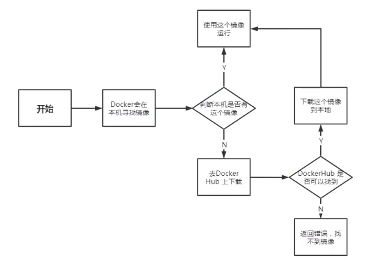
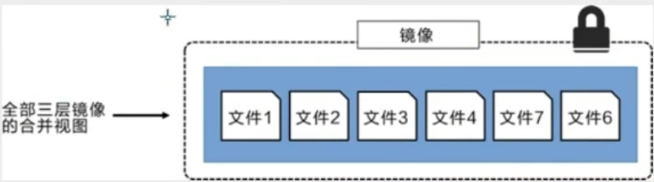

#  Docker 学习
[教程视频地址](https://www.bilibili.com/video/BV1og4y1q7M4?p=9&spm_id_from=pageDriver)

[笔记地址1](https://blog.csdn.net/xiaozecheng/article/details/106145593)
[笔记地址2](https://blog.csdn.net/xiaozecheng/article/details/106165491)
## 一、概述
### 1、大纲
* Docker概述
* Docker安装
* Docker命令
    * 镜像命令 
    * 容器命令
    * 操作命令
    * ...
* Docker镜像
* 容器数据卷
* DockerFile
* Docker网络原理
* IDEA整合Docker
* Docker Compose
* Docker Swarm
* CI\CD Jenkins
### 2、相关网站
* Docker基于Go语言开发的！开源项目！
* > 官网：https://www.docker.com/
* > 文档：https://docs.docker.com/
* > 仓库：https://hub.docker.com/
### 3、Docker优缺点
* 虚拟机技术缺点：
    * 1、资源占用十分多
    * 2、冗余步骤多
    * 3、启动很慢！
    


* 比较Docker和虚拟机技术的不同
    * 传统虚拟机，虚拟出一条硬件，运行一个完整的操作系统，然后在这个系统上安装和运行软件
    * 容器内的应用直接运行在宿主机的内容，容器是没有自己的内核的，也没有虚拟我们的硬件，所以就轻便了
    * 每个容器间是互相隔离，每个容器内都有一个属于自己的文件系统，互不影响
    


* DevOps（开发、运维）
    * 应用更快速的交付和部署
        * 传统：一堆帮助文档，安装程序
        * Docker：打包镜像发布测试一键运行。
    * 更便捷的升级和扩缩容
        * 使用了 Docker之后，我们部署应用就和搭积木一样
        * 项目打包为一个镜像，扩展服务器A！服务器B
    * 更简单的系统运维
        * 在容器化之后，我们的开发，测试环境都是高度一致的
    * 更高效的计算资源利用
        * Docker是内核级别的虚拟化，可以在一个物理机上可以运行很多的容器实例！服务器的性能可以被压榨到极致。
---

## 二、操作
### 1、Docker安装
#### 1.1、Docker的基本组成
* 镜像（image)
    * docker镜像就好比是一个目标，可以通过这个目标来创建容器服务。
    * tomcat镜像==>run==>容器（提供服务器），通过这个镜像可以创建多个容器（最终服务运行或者项目运行就是在容器中的）。
* 容器(container)
    * Docker利用容器技术，独立运行一个或者一组应用，通过镜像来创建的.
    * 启动，停止，删除，基本命令
    * 目前就可以把这个容器理解为就是一个简易的 Linux系统。
* 仓库(repository)
    * 仓库就是存放镜像的地方！
    * 仓库分为公有仓库和私有仓库。(很类似git)
    * Docker Hub是国外的。
    * 阿里云…都有容器服务器(配置镜像加速!)
#### 1.2、安装Docker
* 环境准备：Linux要求内核3.0以上
````
➜  ~ uname -r    
4.15.0-96-generic # 要求3.0以上
➜  ~ cat /etc/os-release 
NAME="Ubuntu"
VERSION="18.04.4 LTS (Bionic Beaver)"
ID=ubuntu
ID_LIKE=debian
PRETTY_NAME="Ubuntu 18.04.4 LTS"
VERSION_ID="18.04"
HOME_URL="https://www.ubuntu.com/"
SUPPORT_URL="https://help.ubuntu.com/"
BUG_REPORT_URL="https://bugs.launchpad.net/ubuntu/"
PRIVACY_POLICY_URL="https://www.ubuntu.com/legal/terms-and-policies/privacy-policy"VERSION_CODENAME=bionic
UBUNTU_CODENAME=bionic
````
* 安装 
> 帮助文档：https://docs.docker.com/engine/install/
````
#1.卸载旧版本
yum remove docker \
                  docker-client \
                  docker-client-latest \
                  docker-common \
                  docker-latest \
                  docker-latest-logrotate \
                  docker-logrotate \
                  docker-engine

#2.需要的安装包
yum install -y yum-utils

#3.设置镜像的仓库
#默认是从国外的，不推荐
yum-config-manager \
    --add-repo \
    https://download.docker.com/linux/centos/docker-ce.repo

#推荐使用国内的
yum-config-manager \
    --add-repo \
    https://mirrors.aliyun.com/docker-ce/linux/centos/docker-ce.repo

#更新yum软件包索引
yum makecache fast

#4.安装docker相关的 docker-ce 社区版 而ee是企业版
yum install docker-ce docker-ce-cli containerd.io

#5、启动docker
docker systemctl start docker

#6. 使用docker version查看是否安装成功
docker version

#7. 测试
docker run hello-world

#1. 卸载依赖
yum remove docker-ce docker-ce-cli containerd.io

#2. 删除资源
rm -rf /var/lib/docker
find / -name docker 
# /var/lib/docker 是docker的默认工作路径！

#7. 测试
➜  ~ docker run hello-world
Hello from Docker!
This message shows that your installation appears to be working correctly.

To generate this message, Docker took the following steps:
 1. The Docker client contacted the Docker daemon.
 2. The Docker daemon pulled the "hello-world" image from the Docker Hub.
    (amd64)
 3. The Docker daemon created a new container from that image which runs the
    executable that produces the output you are currently reading.
 4. The Docker daemon streamed that output to the Docker client, which sent it
    to your terminal.

To try something more ambitious, you can run an Ubuntu container with:
 $ docker run -it ubuntu bash

Share images, automate workflows, and more with a free Docker ID:
 https://hub.docker.com/

For more examples and ideas, visit:
 https://docs.docker.com/get-started/

#8.查看一下下载的镜像
➜  ~ docker images         
REPOSITORY            TAG                 IMAGE ID            CREATED             SIZE
hello-world           latest              bf756fb1ae65        4 months ago        13.3kB
````
* 阿里云镜像加速
    * 登录阿里云找到容器服务

    * 找到镜像加速器

````
sudo mkdir -p /etc/docker
sudo tee /etc/docker/daemon.json <<-'EOF'
{
  "registry-mirrors": ["https://1tskkoog.mirror.aliyuncs.com"]
}
EOF
sudo systemctl daemon-reload
sudo systemctl restart docker
````
#### 1.3、底层原理
* docker run 流程图 




* Docker是怎么工作的？
    * Docker是一个Client-Server结构的系统，Docker的守护进程运行在主机上。通过Socket从客户端访问！
    * Docker-Server接收到Docker-Client的指令，就会执行这个命令
* 为什么Docker比Vm快
     * docker有着比虚拟机更少的抽象层。由于docker不需要Hypervisor实现硬件资源虚拟化,运行在docker容器上的程序直接使用的都是实际物理机的硬件资源。因此在CPU、内存利用率上docker将会在效率上有明显优势。
     * docker利用的是宿主机的内核,而不需要Guest OS
     * 当新建一个容器时,docker不需要和虚拟机一样重新加载一个操作系统内核。
     * 当新建一个虚拟机时,虚拟机软件需要加载GuestOS,返个新建过程是分钟级别的。
     * 当新建一个docker容器只需要几秒钟。
> GuestOS： VM（虚拟机）里的的系统（OS）;
>
> HostOS：物理机里的系统（OS）；   


### 2、常用命令
#### 2.1、帮助命令
````
# 显示docker的版本信息。
docker version
# 显示docker的系统信息，包括镜像和容器的数量  
docker info
# 帮助命令       
docker 命令 --help 
````
> 帮助文档的地址：https://docs.docker.com/engine/reference/commandline/build/
#### 2.2、镜像命令
````
# 查看所有本地主机上的镜像
docker images 
# 搜索镜像
docker search 镜像名
# 下载镜像
docker pull
# 删除镜像
docker rmi
````
* `docker images` 详解 
````
➜  ~ docker images
REPOSITORY            TAG                 IMAGE ID            CREATED             SIZE
mysql                 5.7                 e73346bdf465        24 hours ago        448MB

# 解释
#REPOSITORY			# 镜像的仓库源
#TAG				# 镜像的标签
#IMAGE ID			# 镜像的id
#CREATED			# 镜像的创建时间
#SIZE				# 镜像的大小
# 可选项
Options:
  -a, --all             Show all images (default hides intermediate images) #列出所有镜像
  -q, --quiet           Only show numeric IDs # 只显示镜像的id
  
➜  ~ docker images -aq ＃显示所有镜像的id
e73346bdf465
d03312117bb0
d03312117bb0
602e111c06b6
2869fc110bf7
470671670cac
bf756fb1ae65
5acf0e8da90b
````
* `docker search 镜像名` 详解
````
➜  ~ docker search mysql
NAME                              DESCRIPTION                                     STARS               OFFICIAL            AUTOMATED
mysql                             MySQL is a widely used, open-source relation…   9500                [OK]                
mariadb                           MariaDB is a community-developed fork of MyS…   3444                [OK]  
# --filter=STARS=3000 #搜索出来的镜像就是STARS大于3000的
Options:
  -f, --filter filter   Filter output based on conditions provided
      --format string   Pretty-print search using a Go template
      --limit int       Max number of search results (default 25)
      --no-trunc        Don't truncate output
      
➜  ~ docker search mysql --filter=STARS=3000
NAME                DESCRIPTION                                     STARS               OFFICIAL            AUTOMATED
mysql               MySQL is a widely used, open-source relation…   9500                [OK]             
mariadb             MariaDB is a community-developed fork of MyS…   3444                [OK]
````
* `docker pull 镜像名[:tag]`详解
````
# 下载镜像 docker pull 镜像名[:tag]
➜  ~ docker pull tomcat:8
8: Pulling from library/tomcat # 如果不写tag，默认就是latest
90fe46dd8199: Already exists   # 分层下载： docker image的核心 联合文件系统(不再重复下载，可共用)
35a4f1977689: Already exists 
bbc37f14aded: Already exists 
74e27dc593d4: Already exists 
93a01fbfad7f: Already exists 
1478df405869: Pull complete 
64f0dd11682b: Pull complete 
68ff4e050d11: Pull complete 
f576086003cf: Pull complete 
3b72593ce10e: Pull complete 
Digest: sha256:0c6234e7ec9d10ab32c06423ab829b32e3183ba5bf2620ee66de866df640a027  # 签名 防伪
Status: Downloaded newer image for tomcat:8
docker.io/library/tomcat:8  # 真实地址
---
# 版本号要实际存在
docker pull tomcat:8 
# 等价于
docker pull docker.io/library/tomcat:8

docker pull mysql 
# 等价于
docker pull docker.io/library/mysql:latest
````
* `docker rmi -f` 详解
````
# 删除指定的镜像
➜  ~ docker rmi -f 镜像id 
➜  ~ docker rmi -f 镜像id 镜像id 镜像id 镜像id
# 删除全部的镜像
➜  ~ docker rmi -f $(docker images -aq) 
````

### 2.3、容器命令
````
#  新建容器并启动
docker run [可选参数] 镜像id
# 列出所有运行的容器
docker ps
# 删除指定容器   
docker rm 容器id 
# 启动容器
docker start 容器id     
# 重启容器
docker restart 容器id    
# 停止当前正在运行的容器 
docker stop 容器id
# 强制停止当前容器
docker kill 容器id 
````
* `docker run [可选参数] 镜像id` 详解
````
docker run [可选参数] 镜像id 
# 参书说明
--name="Name"		# 容器名字 tomcat01 tomcat02 用来区分容器
-d					# 后台方式运行
-it 				# 使用交互方式运行，进入容器查看内容
-p					# 指定容器的端口 -p 8080(宿主机):8080(容器)
		-p ip:主机端口:容器端口
		-p 主机端口:容器端口(常用)
		-p 容器端口
		容器端口
-P(大写) 			# 随机指定端
---
# 测试、启动并进入容器
➜  ~ docker run -it 镜像id /bin/bash
[root@95039813da8d /]# ls
bin  dev  etc  home  lib  lib64  lost+found  media  mnt  opt  proc  root  run  sbin  srv  sys  tmp  usr  var
# 从容器退回主机
[root@95039813da8d /]# exit 
exit
--- 

# 后台启动命令的坑
➜  ~ docker run -d centos
a8f922c255859622ac45ce3a535b7a0e8253329be4756ed6e32265d2dd2fac6c
➜  ~ docker ps           
CONTAINER ID        IMAGE               COMMAND             CREATED             STATUS              PORTS               NAMES

# 问题docker ps. 发现centos 停止了
# 常见的坑，docker容器使用后台运行，就必须要有要一个前台进程，docker发现没有应用，就会自动停止
# nginx，容器启动后，发现自己没有提供服务，就会立刻停止，就是没有程序了
````
* `docker ps` 详解
````
# 列出当前正在运行的容器
docker ps
  -a, --all             # 查看所有容器 (正在运行和历史运行)
  -n, --last int        # 显示最近创建的几个容器
  -q, --quiet           # 只显示容器编号

docker ps -a -n=1;
# 测试
➜  ~ docker ps   
CONTAINER ID        IMAGE                 COMMAND                  CREATED             STATUS              PORTS                    NAMES
68729e9654d4        portainer/portainer   "/portainer"             14 hours ago        Up About a minute   0.0.0.0:8088->9000/tcp   funny_curie
d506a017e951        nginx                 "nginx -g 'daemon of…"   15 hours ago        Up 15 hours         0.0.0.0:3344->80/tcp     nginx01

➜  ~ docker ps -a
CONTAINER ID        IMAGE                 COMMAND                  CREATED             STATUS                       PORTS                    NAMES
95039813da8d        centos                "/bin/bash"              3 minutes ago       Exited (0) 2 minutes ago                              condescending_pike
1e46a426a5ba        tomcat                "catalina.sh run"        11 minutes ago      Exited (130) 9 minutes ago                            sweet_gould
14bc9334d1b2        bf756fb1ae65          "/hello"                 3 hours ago         Exited (0) 3 hours ago                                amazing_stonebraker
f10d60f473f5        bf756fb1ae65          "/hello"                 3 hours ago         Exited (0) 3 hours ago                                dreamy_germain
68729e9654d4        portainer/portainer   "/portainer"             14 hours ago        Up About a minute            0.0.0.0:8088->9000/tcp   funny_curie
677cde5e4f1d        elasticsearch         "/docker-entrypoint.…"   15 hours ago        Exited (143) 8 minutes ago                            elasticsearch
33eb3f70b4db        tomcat                "catalina.sh run"        15 hours ago        Exited (143) 8 minutes ago                            tomcat01
d506a017e951        nginx                 "nginx -g 'daemon of…"   15 hours ago        Up 15 hours                  0.0.0.0:3344->80/tcp     nginx01
24ce2db02e45        centos                "/bin/bash"              16 hours ago        Exited (0) 15 hours ago                               hopeful_faraday
42267d1ad80b        bf756fb1ae65          "/hello"                 16 hours ago        Exited (0) 16 hours ago                               ecstatic_sutherland

➜  ~ docker ps -aq
95039813da8d
1e46a426a5ba
14bc9334d1b2
f10d60f473f5
68729e9654d4
677cde5e4f1d
33eb3f70b4db
d506a017e951
24ce2db02e45
42267d1ad80b
````
* 退出容器
````
# 容器直接退出
exit
# 容器不停止退出
ctrl + P + Q 
````
* `docker rm 容器id `详解
````
# 删除单个容器 不能删除正在运行的容器
docker rm 容器id
# 删除全部容器 即便在运行也可以删除（强制删除）
docker rm -f $(docker ps -qa)
docker ps -a -q | xargs docker rm 
````
* `docker start 容器id ` 详解
````
# 启动容器
docker start 容器id
# 重启容器
docker restart 容器id
# 停止当前正在运行的容器
docker stop 容器id
# 强制停止当前容器
docker kill 容器id	
````

### 2.4、查看日志
``````
docker logs --help
Options:
      --details        Show extra details provided to logs 
  -f, --follow         Follow log output
      --since string   Show logs since timestamp (e.g. 2013-01-02T13:23:37) or relative (e.g. 42m for 42 minutes)
      --tail string    Number of lines to show from the end of the logs (default "all")
  -t, --timestamps     Show timestamps
      --until string   Show logs before a timestamp (e.g. 2013-01-02T13:23:37) or relative (e.g. 42m for 42 minutes)
---
# -tf		    #显示日志信息（一直更新）
# --tail number #需要显示日志条数

docker logs -tf --tail 10 正在运行的容器id

# 由于没有日志显示，因此编写一段脚本模拟日志 
docker run -d 300e315adb2f /bin/sh -c "while true;do echo 6666;sleep 1;done"
``````
### 2.5、查看进程信息
````
# 命令
docker top 容器id
--- 
[root@VM-0-9-centos ~]# docker top 5614181f7ae3
UID                 PID                 PPID                C                   STIME               TTY                 TIME                CMD
root                22639               22620               0                   00:00               pts/0               00:00:00            /bin/bash
# UID  用户ID 
# PID  进程ID
# PPID 父进程ID
````
### 2.6、查看镜像元数据
````
docker inspect 容器id

#测试
➜  ~ docker inspect 55321bcae33d
[
    {
        # 容器全id
        "Id": "55321bcae33d15da8280bcac1d2bc1141d213bcc8f8e792edfd832ff61ae5066",
        "Created": "2020-05-15T05:22:05.515909071Z",
        "Path": "/bin/sh",
        "Args": [
            "-c",
            "while true;do echo 6666;sleep 1;done"
        ],
        # 状态相关
        "State": {
            "Status": "running",
            "Running": true,
            "Paused": false,
            "Restarting": false,
            "OOMKilled": false,
            "Dead": false,
            "Pid": 22973,
            "ExitCode": 0,
            "Error": "",
            "StartedAt": "2020-05-15T05:22:06.165904633Z",
            "FinishedAt": "0001-01-01T00:00:00Z"
        },
        # 镜像相关
        "Image": "sha256:470671670cac686c7cf0081e0b37da2e9f4f768ddc5f6a26102ccd1c6954c1ee",
        "ResolvConfPath": "/var/lib/docker/containers/55321bcae33d15da8280bcac1d2bc1141d213bcc8f8e792edfd832ff61ae5066/resolv.conf",
        "HostnamePath": "/var/lib/docker/containers/55321bcae33d15da8280bcac1d2bc1141d213bcc8f8e792edfd832ff61ae5066/hostname",
        "HostsPath": "/var/lib/docker/containers/55321bcae33d15da8280bcac1d2bc1141d213bcc8f8e792edfd832ff61ae5066/hosts",
        "LogPath": "/var/lib/docker/containers/55321bcae33d15da8280bcac1d2bc1141d213bcc8f8e792edfd832ff61ae5066/55321bcae33d15da8280bcac1d2bc1141d213bcc8f8e792edfd832ff61ae5066-json.log",
        "Name": "/bold_bell",
        "RestartCount": 0,
        "Driver": "overlay2",
        "Platform": "linux",
        "MountLabel": "",
        "ProcessLabel": "",
        "AppArmorProfile": "docker-default",
        "ExecIDs": null,
        "HostConfig": {
            "Binds": null,
            "ContainerIDFile": "",
            "LogConfig": {
                "Type": "json-file",
                "Config": {}
            },
            "NetworkMode": "default",
            "PortBindings": {},
            "RestartPolicy": {
                "Name": "no",
                "MaximumRetryCount": 0
            },
            "AutoRemove": false,
            "VolumeDriver": "",
            "VolumesFrom": null,
            "CapAdd": null,
            "CapDrop": null,
            "Capabilities": null,
            "Dns": [],
            "DnsOptions": [],
            "DnsSearch": [],
            "ExtraHosts": null,
            "GroupAdd": null,
            "IpcMode": "private",
            "Cgroup": "",
            "Links": null,
            "OomScoreAdj": 0,
            "PidMode": "",
            "Privileged": false,
            "PublishAllPorts": false,
            "ReadonlyRootfs": false,
            "SecurityOpt": null,
            "UTSMode": "",
            "UsernsMode": "",
            "ShmSize": 67108864,
            "Runtime": "runc",
            "ConsoleSize": [
                0,
                0
            ],
            "Isolation": "",
            "CpuShares": 0,
            "Memory": 0,
            "NanoCpus": 0,
            "CgroupParent": "",
            "BlkioWeight": 0,
            "BlkioWeightDevice": [],
            "BlkioDeviceReadBps": null,
            "BlkioDeviceWriteBps": null,
            "BlkioDeviceReadIOps": null,
            "BlkioDeviceWriteIOps": null,
            "CpuPeriod": 0,
            "CpuQuota": 0,
            "CpuRealtimePeriod": 0,
            "CpuRealtimeRuntime": 0,
            "CpusetCpus": "",
            "CpusetMems": "",
            "Devices": [],
            "DeviceCgroupRules": null,
            "DeviceRequests": null,
            "KernelMemory": 0,
            "KernelMemoryTCP": 0,
            "MemoryReservation": 0,
            "MemorySwap": 0,
            "MemorySwappiness": null,
            "OomKillDisable": false,
            "PidsLimit": null,
            "Ulimits": null,
            "CpuCount": 0,
            "CpuPercent": 0,
            "IOMaximumIOps": 0,
            "IOMaximumBandwidth": 0,
            "MaskedPaths": [
                "/proc/asound",
                "/proc/acpi",
                "/proc/kcore",
                "/proc/keys",
                "/proc/latency_stats",
                "/proc/timer_list",
                "/proc/timer_stats",
                "/proc/sched_debug",
                "/proc/scsi",
                "/sys/firmware"
            ],
            "ReadonlyPaths": [
                "/proc/bus",
                "/proc/fs",
                "/proc/irq",
                "/proc/sys",
                "/proc/sysrq-trigger"
            ]
        },
        "GraphDriver": {
            "Data": {
                "LowerDir": "/var/lib/docker/overlay2/1f347949ba49c4dbee70cea9ff3af39a14e602bc8fac8331c46347bf6708757a-init/diff:/var/lib/docker/overlay2/5afcd8220c51854a847a36f52775b4ed0acb16fe6cfaec3bd2e5df59863835ba/diff",
                "MergedDir": "/var/lib/docker/overlay2/1f347949ba49c4dbee70cea9ff3af39a14e602bc8fac8331c46347bf6708757a/merged",
                "UpperDir": "/var/lib/docker/overlay2/1f347949ba49c4dbee70cea9ff3af39a14e602bc8fac8331c46347bf6708757a/diff",
                "WorkDir": "/var/lib/docker/overlay2/1f347949ba49c4dbee70cea9ff3af39a14e602bc8fac8331c46347bf6708757a/work"
            },
            "Name": "overlay2"
        },
        # 挂载
        "Mounts": [],
        "Config": {
            "Hostname": "55321bcae33d",
            "Domainname": "",
            "User": "",
            "AttachStdin": false,
            "AttachStdout": false,
            "AttachStderr": false,
            "Tty": false,
            "OpenStdin": false,
            "StdinOnce": false,
            "Env": [
                "PATH=/usr/local/sbin:/usr/local/bin:/usr/sbin:/usr/bin:/sbin:/bin"
            ],
            "Cmd": [
                "/bin/sh",
                "-c",
                "while true;do echo 6666;sleep 1;done"
            ],
            "Image": "centos",
            "Volumes": null,
            "WorkingDir": "",
            "Entrypoint": null,
            "OnBuild": null,
            "Labels": {
                "org.label-schema.build-date": "20200114",
                "org.label-schema.license": "GPLv2",
                "org.label-schema.name": "CentOS Base Image",
                "org.label-schema.schema-version": "1.0",
                "org.label-schema.vendor": "CentOS",
                "org.opencontainers.image.created": "2020-01-14 00:00:00-08:00",
                "org.opencontainers.image.licenses": "GPL-2.0-only",
                "org.opencontainers.image.title": "CentOS Base Image",
                "org.opencontainers.image.vendor": "CentOS"
            }
        },
        # 网络相关
        "NetworkSettings": {
            # 桥接
            "Bridge": "",
            "SandboxID": "63ed0c837f35c12453bae9661859f37a08541a0749afb86e881869bf6fd9031b",
            "HairpinMode": false,
            "LinkLocalIPv6Address": "",
            "LinkLocalIPv6PrefixLen": 0,
            "Ports": {},
            "SandboxKey": "/var/run/docker/netns/63ed0c837f35",
            "SecondaryIPAddresses": null,
            "SecondaryIPv6Addresses": null,
            "EndpointID": "b129d9a5a2cbb92722a2101244bd81a9e3d8af034e83f338c13790a1a94552a1",
            "Gateway": "172.17.0.1",
            "GlobalIPv6Address": "",
            "GlobalIPv6PrefixLen": 0,
            "IPAddress": "172.17.0.4",
            "IPPrefixLen": 16,
            "IPv6Gateway": "",
            "MacAddress": "02:42:ac:11:00:04",
            "Networks": {
                "bridge": {
                    "IPAMConfig": null,
                    "Links": null,
                    "Aliases": null,
                    "NetworkID": "ad5ada6a106f5ba3dda9ce4bc1475a4bb593bf5f7fbead72196e66515e8ac36a",
                    "EndpointID": "b129d9a5a2cbb92722a2101244bd81a9e3d8af034e83f338c13790a1a94552a1",
                    "Gateway": "172.17.0.1",
                    "IPAddress": "172.17.0.4",
                    "IPPrefixLen": 16,
                    "IPv6Gateway": "",
                    "GlobalIPv6Address": "",
                    "GlobalIPv6PrefixLen": 0,
                    "MacAddress": "02:42:ac:11:00:04",
                    "DriverOpts": null
                }
            }
        }
    }
]
````
### 2.7、进入当前正在运行的容器
````
# 方式一
docker exec -it 容器id /bin/bash
# 方式二
docker attach 容器id
# 区别
docker exec   # 进入当前容器后开启一个新的终端，可以在里面操作。（常用）
docker attach # 进入容器正在执行的终端
---
# 测试
[root@VM-0-9-centos ~]# ps -a 
  PID TTY          TIME CMD
26386 pts/0    00:00:00 ps

[root@VM-0-9-centos ~]# docker ps -a
CONTAINER ID   IMAGE          COMMAND                  CREATED        STATUS                      PORTS     NAMES
47ea8c85edb4   300e315adb2f   "/bin/sh -c 'while t…"   24 hours ago   Exited (137) 24 hours ago             crazy_roentgen
5614181f7ae3   300e315adb2f   "/bin/bash"              25 hours ago   Up 19 minutes                         tender_keller
[root@VM-0-9-centos ~]# docker images
REPOSITORY   TAG       IMAGE ID       CREATED        SIZE
centos       latest    300e315adb2f   2 months ago   209MB

[root@VM-0-9-centos ~]# docker exec -it 5614181f7ae3 /bin/bash

[root@5614181f7ae3 /]# ls
bin  dev  etc  home  lib  lib64  lost+found  media  mnt  opt  proc  root  run  sbin  srv  sys  tmp  usr  var

[root@5614181f7ae3 /]# ps -ef
UID        PID  PPID  C STIME TTY          TIME CMD
root         1     0  0 16:00 pts/0    00:00:00 /bin/bash
root        15     0  0 16:20 pts/1    00:00:00 /bin/bash
root        30    15  0 16:20 pts/1    00:00:00 ps -ef

# 测试 
docker attach 55321bcae33d 
正在执行当前的代码...
````
### 2.8 从容器内拷贝到主机
* 拷贝是一个手动的过程，未来使用 -v 卷的技术，可以实现
````
docker cp 容器id:容器内路径/文件名称 宿主机内存放路径
# 容器运行停止与否无关文件的复制

# 测试 
# 进入docker容器内部
➜  ~ docker exec -it  55321bcae33d /bin/bash 
[root@55321bcae33d /]# ls
bin  etc   lib    lost+found  mnt  proc  run   srv  tmp  var
dev  home  lib64  media       opt  root  sbin  sys  usr
# 新建一个文件
[root@55321bcae33d /]# echo "hello" > java.java
[root@55321bcae33d /]# cat java.java 
hello
[root@55321bcae33d /]# exit
exit
# 拷贝
➜  ~ docker cp 55321bcae33d:/java.java /    
➜  ~ cd /              
➜  / ls  #可以看见java.java存在
bin   home            lib         mnt   run       sys  vmlinuz
boot  initrd.img      lib64       opt   sbin      tmp  vmlinuz.old
dev   initrd.img.old  lost+found  proc  srv       usr  wget-log
etc   java.java       media       root  swapfile  var  
````
---

### 3、常用命令小结


---

### 4、课后作业
#### 4.1、安装Nginx
````
# 思考问题：我们每次改动nginx配置文件，都需要进入容器内部？
# 十分的麻烦，要是可以在容器外部提供一个映射路径，达到在容器修改文件名，
# 容器内部就可以自动修改？√数据卷！

# 1、搜索镜像 search 建议大家去docker搜索，可以看到帮助文档
# 2、拉取镜像 pull
# 3、运行容器
➜  ~ docker run -d --name nginx00 -p 82:80 nginx
75943663c116f5ed006a0042c42f78e9a1a6a52eba66311666eee12e1c8a4502
# -d 后台运行
# --name 给容器命名
# -p 宿主机端口：容器内部端口
➜  ~ docker ps
CONTAINER ID        IMAGE               COMMAND                  CREATED             STATUS              PORTS                NAMES
75943663c116        nginx               "nginx -g 'daemon of…"   41 seconds ago      Up 40 seconds       0.0.0.0:82->80/tcp   nginx00
# 4、测试连接
➜  ~ curl localhost:82 
<!DOCTYPE html>,,,,
# 进入容器
docker exec -it nginx /bin/bash
# 查找Nginx配置文件
whereis nginx
# 
````


#### 4.2、安装Tomcat
````
# 官方的使用
docker run -it --rm tomcat:9.0
# 之前的启动都是后台，停止了容器，容器还是可以查到
# docker run -it --rm image 一般是用来测试，用完就删除
--rm       Automatically remove the container when it exits
# 下载
docker pull tomcat
# 启动运行
docker run -d -p 8080:8080 --name tomcat01 tomcat
# 测试访问有没有问题
curl localhost:8080
# 进入容器
➜  ~ docker ps
CONTAINER ID        IMAGE               COMMAND             CREATED             STATUS              PORTS                    NAMES
db09851cf82e        tomcat              "catalina.sh run"   28 seconds ago      Up 27 seconds       0.0.0.0:8080->8080/tcp   tomcat01
➜  ~ docker exec -it db09851cf82e /bin/bash             
root@db09851cf82e:/usr/local/tomcat#
# 补全tomcat 
cp webapps.dist/* webapps
# 发现问题：1、linux命令少了。 2.没有webapps
# 思考问题：我们以后要部署项目，如果每次都要进入容器是不是十分麻烦？
# 要是可以在容器外部提供一个映射路径，webapps，我们在外部放置项目，就自动同步内部就好了！
````

#### 4.3、部署 ES + Kibana
````
# es 暴露端口比较多
# 耗内存
# 需要网络配置

# 启动elasticsearch
docker run -d --name elasticsearch -p 9200:9200 -p 9300:9300 -e "discovery.type=single-node" elasticsearch:7.6.2
# 测试一下es是否成功启动
➜  ~ curl localhost:9200
{
  "name" : "d73ad2f22dd3",
  "cluster_name" : "docker-cluster",
  "cluster_uuid" : "atFKgANxS8CzgIyCB8PGxA",
  "version" : {
    "number" : "7.6.2",
    "build_flavor" : "default",
    "build_type" : "docker",
    "build_hash" : "ef48eb35cf30adf4db14086e8aabd07ef6fb113f",
    "build_date" : "2020-03-26T06:34:37.794943Z",
    "build_snapshot" : false,
    "lucene_version" : "8.4.0",
    "minimum_wire_compatibility_version" : "6.8.0",
    "minimum_index_compatibility_version" : "6.0.0-beta1"
  },
  "tagline" : "You Know, for Search"
}

# 查看docker容器使用内存情况
➜  ~ docker stats 
````

````
#关闭，添加内存的限制，修改配置文件 -e 环境配置修改
➜  ~ docker rm -f d73ad2f22dd3                                                  
➜  ~ docker run -d --name e lasticsearch -p 9200:9200 -p 9300:9300 -e "discovery.type=single-node" -e ES_JAVA_OPTS="-Xms64m -Xmx512m" elasticsearch:7.6.2
# -e 环境配置修改
````
---

### 5、可视化
* portainer
* Rancher(CI/CD再用)
````
docker run -d -p 8080:9000 \--restart=always -v /var/run/docker.sock:/var/run/docker.sock --privileged=true portainer/portainer
# --restart=always 启动方式
# -v /var/run/docker.sock:/var/run/docker.sock 挂载
# --privileged=true 授权
# 测试访问: 外网：8080,或如下
curl localhost:8080
````
---

### 6、Docker镜像加载原理
* 镜像是什么
    * 镜像是一种轻量级、可执行的独立软件保，用来打包软件运行环境和基于运行环境开发的软件，他包含运行某个软件所需的所有内容，包括代码、运行时库、环境变量和配置文件
* 6.1、UnionFs （联合文件系统）
    * Union文件系统（UnionFs）是一种分层、轻量级并且高性能的文件系统,是 Docker镜像的基础。
    * 支持对文件系统的修改作为一次提交来一层层的叠加，可以将不同目录挂载到同一个虚拟文件系统下（ unite several directories into a single virtual filesystem)。
    * 镜像可以通过分层来进行继承，基于基础镜像（没有父镜像），可以制作各种具体的应用镜像
    * 特性：一次同时加载多个文件系统，但从外面看起来，只能看到一个文件系统，联合加载会把各层文件系统叠加起来，这样最终的文件系统会包含所有底层的文件和目录
*  6.2、Docker镜像加载原理
    * boots(boot file system）主要包含 bootloader和 Kernel。
        * 在 Docker镜像的最底层是 boots，这一层与我们典型的Linux/Unix系统是一样的，包含boot加載器和内核。
        * bootloader主要是引导加 kernel, Linux刚启动时会加bootfs文件系统。
        * 当boot加载完成之后整个内核就都在内存中了，此时内存的使用权已由 bootfs转交给内核，此时系统也会卸载bootfs。
    * rootfs（root file system)
        * 在 bootfs之上。包含的就是典型 Linux系统中的/dev,/proc,/bin,/etc等标准目录和文件。 
        * rootfs就是各种不同的操作系统发行版，比如 Ubuntu, Centos等等。        
        


* 平时我们安装进虚拟机的CentOS都是好几个G，为什么Docker这里才200M？
    * 对于个精简的OS,rootfs可以很小，只需要包合最基本的命令，工具和程序库就可以了，因为底层直接用Host的kernel，自己只需要提供rootfs就可以了。由此可见对于不同的Linux发行版， boots基本是一致的，rootfs会有差別，因此不同的发行版可以公用bootfs.虚拟机是分钟级别，容器是秒级！
---
### 7、Dokcer 分层原理
* 通过下载可以发现是分层下载的

 

* 思考：为什么Docker镜像要采用这种分层的结构呢？
    * 资源共享。比如有多个镜像都从相同的Base镜像构建而来，那么宿主机只需在磁盘上保留一份base镜像，同时内存中也只需要加载一份base镜像，这样就可以为所有的容器服务了，而且镜像的每一层都可以被共享。
````
# 查看镜像分层的方式可以通过docker image inspect 命令
➜  / docker image inspect redis          
[
    {
        "Id": "sha256:f9b9909726890b00d2098081642edf32e5211b7ab53563929a47f250bcdc1d7c",
        "RepoTags": [
            "redis:latest"
        ],
        "RepoDigests": [
            "redis@sha256:399a9b17b8522e24fbe2fd3b42474d4bb668d3994153c4b5d38c3dafd5903e32"
        ],
        "Parent": "",
        "Comment": "",
        "Created": "2020-05-02T01:40:19.112130797Z",
        "Container": "d30c0bcea88561bc5139821227d2199bb027eeba9083f90c701891b4affce3bc",
        "ContainerConfig": {
            "Hostname": "d30c0bcea885",
            "Domainname": "",
            "User": "",
            "AttachStdin": false,
            "AttachStdout": false,
            "AttachStderr": false,
            "ExposedPorts": {
                "6379/tcp": {}
            },
            "Tty": false,
            "OpenStdin": false,
            "StdinOnce": false,
            "Env": [
                "PATH=/usr/local/sbin:/usr/local/bin:/usr/sbin:/usr/bin:/sbin:/bin",
                "GOSU_VERSION=1.12",
                "REDIS_VERSION=6.0.1",
                "REDIS_DOWNLOAD_URL=http://download.redis.io/releases/redis-6.0.1.tar.gz",
                "REDIS_DOWNLOAD_SHA=b8756e430479edc162ba9c44dc89ac394316cd482f2dc6b91bcd5fe12593f273"
            ],
            "Cmd": [
                "/bin/sh",
                "-c",
                "#(nop) ",
                "CMD [\"redis-server\"]"
            ],
            "ArgsEscaped": true,
            "Image": "sha256:704c602fa36f41a6d2d08e49bd2319ccd6915418f545c838416318b3c29811e0",
            "Volumes": {
                "/data": {}
            },
            "WorkingDir": "/data",
            "Entrypoint": [
                "docker-entrypoint.sh"
            ],
            "OnBuild": null,
            "Labels": {}
        },
        "DockerVersion": "18.09.7",
        "Author": "",
        "Config": {
            "Hostname": "",
            "Domainname": "",
            "User": "",
            "AttachStdin": false,
            "AttachStdout": false,
            "AttachStderr": false,
            "ExposedPorts": {
                "6379/tcp": {}
            },
            "Tty": false,
            "OpenStdin": false,
            "StdinOnce": false,
            "Env": [
                "PATH=/usr/local/sbin:/usr/local/bin:/usr/sbin:/usr/bin:/sbin:/bin",
                "GOSU_VERSION=1.12",
                "REDIS_VERSION=6.0.1",
                "REDIS_DOWNLOAD_URL=http://download.redis.io/releases/redis-6.0.1.tar.gz",
                "REDIS_DOWNLOAD_SHA=b8756e430479edc162ba9c44dc89ac394316cd482f2dc6b91bcd5fe12593f273"
            ],
            "Cmd": [
                "redis-server"
            ],
            "ArgsEscaped": true,
            "Image": "sha256:704c602fa36f41a6d2d08e49bd2319ccd6915418f545c838416318b3c29811e0",
            "Volumes": {
                "/data": {}
            },
            "WorkingDir": "/data",
            "Entrypoint": [
                "docker-entrypoint.sh"
            ],
            "OnBuild": null,
            "Labels": null
        },
        "Architecture": "amd64",
        "Os": "linux",
        "Size": 104101893,
        "VirtualSize": 104101893,
        "GraphDriver": {
            "Data": {
                "LowerDir": "/var/lib/docker/overlay2/adea96bbe6518657dc2d4c6331a807eea70567144abda686588ef6c3bb0d778a/diff:/var/lib/docker/overlay2/66abd822d34dc6446e6bebe73721dfd1dc497c2c8063c43ffb8cf8140e2caeb6/diff:/var/lib/docker/overlay2/d19d24fb6a24801c5fa639c1d979d19f3f17196b3c6dde96d3b69cd2ad07ba8a/diff:/var/lib/docker/overlay2/a1e95aae5e09ca6df4f71b542c86c677b884f5280c1d3e3a1111b13644b221f9/diff:/var/lib/docker/overlay2/cd90f7a9cd0227c1db29ea992e889e4e6af057d9ab2835dd18a67a019c18bab4/diff",
                "MergedDir": "/var/lib/docker/overlay2/afa1de233453b60686a3847854624ef191d7bc317fb01e015b4f06671139fb11/merged",
                "UpperDir": "/var/lib/docker/overlay2/afa1de233453b60686a3847854624ef191d7bc317fb01e015b4f06671139fb11/diff",
                "WorkDir": "/var/lib/docker/overlay2/afa1de233453b60686a3847854624ef191d7bc317fb01e015b4f06671139fb11/work"
            },
            "Name": "overlay2"
        },
        "RootFS": {
            "Type": "layers",
            "Layers": [
                "sha256:c2adabaecedbda0af72b153c6499a0555f3a769d52370469d8f6bd6328af9b13",
                "sha256:744315296a49be711c312dfa1b3a80516116f78c437367ff0bc678da1123e990",
                "sha256:379ef5d5cb402a5538413d7285b21aa58a560882d15f1f553f7868dc4b66afa8",
                "sha256:d00fd460effb7b066760f97447c071492d471c5176d05b8af1751806a1f905f8",
                "sha256:4d0c196331523cfed7bf5bafd616ecb3855256838d850b6f3d5fba911f6c4123",
                "sha256:98b4a6242af2536383425ba2d6de033a510e049d9ca07ff501b95052da76e894"
            ]
        },
        "Metadata": {
            "LastTagTime": "0001-01-01T00:00:00Z"
        }
    }
]
````
* 理解
    * 所有的 Docker镜像都起始于一个基础镜像层，当进行修改或培加新的内容时，就会在当前镜像层之上，创建新的镜像层。
* 例子1: 
    * 基于 Ubuntu Linux16.04创建一个新的镜像(基于 Ubuntu Linux16.04创建一个新的镜像),
    * 在该镜像中添加 Python包，就会在基础镜像层之上创建第二个镜像层,
    * 如果继续添加一个安全补丁，就会创健第三个镜像层该像
    * 在添加额外的镜像层的同时，镜像始终保持是当前所有镜像的组合，理解这一点非常重要。下图中举了一个简单的例子，每个镜像层包含3个文件，而镜像包含了来自两个镜像层的6个文件。
    


* 例子2:
    * 展示一个稍微复杂的三层镜像，在外部看来整个镜像只有6个文件，这是因为最上层中的文件7是文件5的一个更新版。上层镜像层中的文件覆盖了底层镜像层中的文件。这样就使得文件的更新版本作为一个新镜像层添加到镜像当中。
            


* 展示与系统显示相同的三层镜像。所有镜像层堆并合井，对外提供统一的视图


    
* 特点 
    * Docker 镜像都是只读的，当容器启动时，一个新的可写层加载到镜像的顶部！这一层就是我们通常说的容器层，容器之下的都叫镜像层！
    

---

### 7、commit镜像
````
# 提交容器成为一个新的副本
docker commit -m="描述信息" -a="作者" 容器id 目标镜像名:[TAG]

# 实战
# 1、启动一个默认的tomcat
docker run -d -p 8080:8080 tomcat
# 2、发现这个默认的tomcat 是没有webapps应用，官方的镜像默认webapps下面是没有文件的！
docker exec -it 容器id
# 3、拷贝文件进去
cp 需要拷贝的文件 拷贝目的地
# 4、将操作过的容器通过commit调教为一个镜像！我们以后就使用我们修改过的镜像即可，这就是我们自己的一个修改的镜像。
docker commit -m="描述信息" -a="作者" 容器id 目标镜像名:[TAG]
docker commit -a="kuangshen" -m="add webapps app" 容器id tomcat02:1.0

# 如果你想要保存当前容器的状态，就可以通过commit来提交，获得一个镜像，就好比我们我们使用虚拟机的快照。
````


---

### 8、 


    

      
